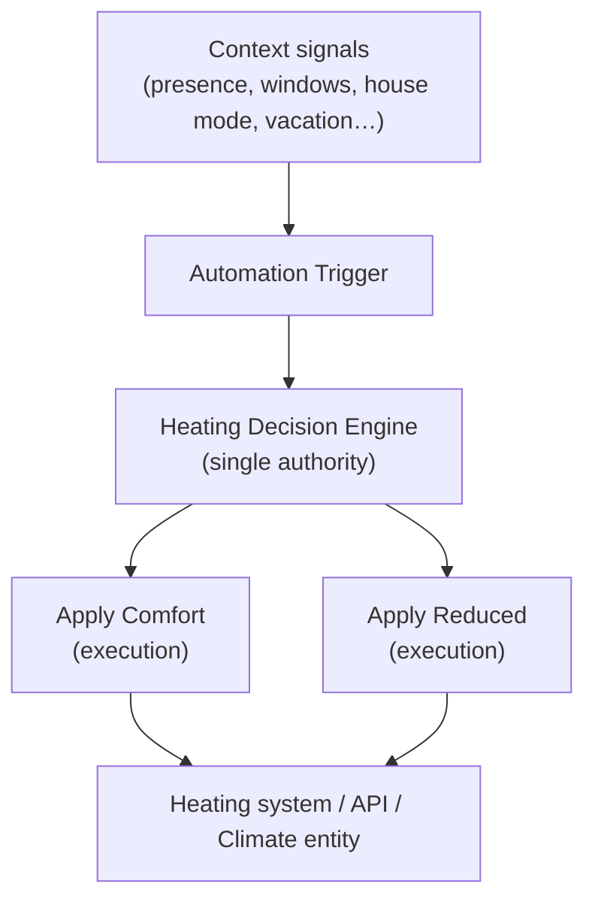

# Heating Control Architecture

```mermaid
flowchart TD
    A["Context signals\n(presence, windows, house mode, vacation…)"]
    B["Automation Trigger"]
    C["Heating Decision Engine\n(single authority)"]
    D["Apply Comfort\n(execution)"]
    E["Apply Reduced\n(execution)"]
    F["Heating system / API / Climate entity"]

    A --> B --> C
    C --> D --> F
    C --> E --> F
```
